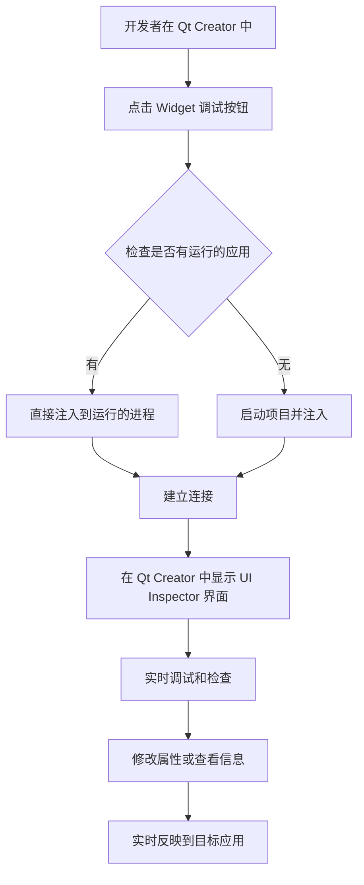
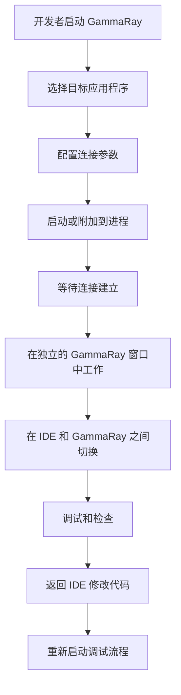

# UI Inspector Plugin for Qt Creator

## 概述

UI Inspector 是一个集成到 Qt Creator 中的强大插件，它将 GammaRay 的核心功能嵌入到 IDE 中，为 Qt 应用程序提供实时的 UI 调试和检查功能。该插件允许开发者在不离开 Qt Creator 的情况下，深入分析和调试正在运行的 Qt 应用程序的用户界面。

## 主要功能

### 🔍 实时 UI 检查
- **QObject 树浏览**: 实时查看和浏览应用程序的 QObject 层次结构
- **属性编辑**: 查看和编辑对象属性，支持实时修改
- **信号槽监控**: 监控 QObject 的信号发射和槽调用
- **连接关系查看**: 显示所有信号槽连接关系

### 🎨 Widget 调试
- **布局信息覆盖**: 为 QWidget应用程序提供布局信息叠加显示
- **绘制操作检查**: 检查用于绘制特定 widget 的所有 QPainter 操作
- **样式检查**: 检查 QStyle 的所有构建块
- **坐标系统可视化**: 显示坐标系统、变换原点、旋转/缩放/平移等


## 功能对比矩阵

| 功能特性 | UI Inspector | 传统 GammaRay | 说明 |
|---------|-------------|--------------|------|
| **基础调试功能** |
| QObject 树浏览 | ✅ | ✅ | 两者都支持完整的对象树浏览 |
| 属性编辑 | ✅ | ✅ | 实时属性查看和修改 |
| 信号槽监控 | ✅ | ✅ | 信号发射和槽调用跟踪 |
| Widget 检查 | ✅ | ✅ | 布局、样式、绘制操作检查 |
| QtQuick 支持 | ✅ | ✅ | QML 项目树和场景图检查 |
| **集成特性** |
| IDE 内嵌 | ✅ | ❌ | UI Inspector 直接集成在 Qt Creator 中 |
| 项目感知 | ✅ | ❌ | 自动识别当前项目和构建配置 |
| 一键启动 | ✅ | ❌ | 通过菜单直接启动，无需额外配置 |
| 自动注入 | ✅ | ⚠️ | UI Inspector 自动处理，GammaRay 需手动配置 |
| **高级功能** |
| 远程调试 | ❌ | ✅ | GammaRay 支持远程目标设备 |
| 完整工具集 | ⚠️ | ✅ | GammaRay 提供更多专业工具 |
| 插件扩展 | ❌ | ✅ | GammaRay 支持第三方插件 |
| 脚本调试 | ❌ | ✅ | JavaScript 调试器支持 |
| **用户体验** |
| 学习曲线 | 低 | 高 | UI Inspector 更易上手abi兼容, GammaRay需要自行配置环境编译匹配abi版本|
| 工作流程 | 流畅 | 分离 | UI Inspector 无需切换应用 |
| 错误处理 | 友好 | 标准 | 更好的错误提示和恢复 |


## 与传统 GammaRay 的对比

### 🎯 UI Inspector 的优势

#### 1. **无缝集成**
- **IDE 内嵌**: 直接集成在 Qt Creator 中，无需切换应用程序
- **统一工作流**: 开发、调试、UI 检查在同一环境中完成
- **项目感知**: 自动识别当前项目和运行配置

#### 2. **简化的工作流程**
- **一键启动**: 通过菜单或快捷键直接启动 UI 调试
- **自动注入**: 自动处理进程注入，无需手动配置
- **智能检测**: 自动检测编译器类型、架构和构建配置

#### 3. **更好的用户体验**
- **上下文感知**: 基于当前项目状态提供相关功能
- **错误处理**: 更友好的错误提示和日志记录

#### 4. **技术优势**
- **轻量级**: 只包含必要的 GammaRay 组件，减少资源占用，通信架构反转
- **快速启动**: 基于IDE探针注入极大优化的启动流程,减少等待时间
- **稳定性**: 针对 Qt Creator 环境优化，提高稳定性

### 📈 传统 GammaRay 的特点

#### 优点
- **功能完整**: 提供所有 GammaRay 功能
- **独立运行**: 可以独立于 IDE 运行
- **跨平台**: 支持多种平台和部署方式
- **远程调试**: 支持远程目标设备调试

#### 局限性
- **工作流分离**: 需要在 IDE 和 GammaRay 之间切换
- **配置复杂**: 需要手动配置连接和注入参数
- **学习曲线**: 需要额外学习 GammaRay 的环境配置编译以及使用方法

## 架构设计

### UI Inspector 架构

```
┌─────────────────────────────────────────────────────────────┐
│                    Qt Creator IDE                           │
├─────────────────────────────────────────────────────────────┤
│  UI Inspector Plugin                                        │
│  ┌─────────────────┐  ┌─────────────────┐  ┌─────────────┐ │
│  │ UIInspectorMode │  │ InjectManager   │  │ OptionsPage │ │
│  └─────────────────┘  └─────────────────┘  └─────────────┘ │
│           │                     │                   │       │
│           └─────────────────────┼───────────────────┘       │
│                                 │                           │
│  ┌─────────────────────────────────────────────────────────┐ │
│  │            GammaRay Client Components                   │ │
│  │  ┌─────────────────┐  ┌─────────────────────────────┐  │ │
│  │  │ ClientView      │  │ ClientConnectionManager     │  │ │
│  │  └─────────────────┘  └─────────────────────────────┘  │ │
│  └─────────────────────────────────────────────────────────┘ │
└─────────────────────────────────────────────────────────────┘
                                 │
                                 │ IPC/Socket
                                 ▼
┌─────────────────────────────────────────────────────────────┐
│                Target Qt Application                        │
│  ┌─────────────────────────────────────────────────────────┐ │
│  │              GammaRay Probe (Injected)                 │ │
│  │  ┌─────────────┐  ┌─────────────┐  ┌─────────────────┐ │ │
│  │  │ ObjectModel │  │ ToolManager │  │ PropertySyncer  │ │ │
│  │  └─────────────┘  └─────────────┘  └─────────────────┘ │ │
│  └─────────────────────────────────────────────────────────┘ │
│                           │                                 │
│                           ▼                                 │
│  ┌─────────────────────────────────────────────────────────┐ │
│  │                Qt Application Objects                   │ │
│  │     QWidgets, QML Items, Models, etc.                  │ │
│  └─────────────────────────────────────────────────────────┘ │
└─────────────────────────────────────────────────────────────┘
```

### 传统 GammaRay 架构

```
┌─────────────────────────────────────────────────────────────┐
│                  GammaRay Launcher                          │
│  ┌─────────────────┐  ┌─────────────────┐  ┌─────────────┐ │
│  │ Process Manager │  │ Probe Injector  │  │ UI Launcher │ │
│  └─────────────────┘  └─────────────────┘  └─────────────┘ │
└─────────────────────────────────────────────────────────────┘
                                 │
                                 │ Process Injection
                                 ▼
┌─────────────────────────────────────────────────────────────┐
│                Target Qt Application                        │
│  ┌─────────────────────────────────────────────────────────┐ │
│  │              GammaRay Probe (Injected)                 │ │
│  │  ┌─────────────┐  ┌─────────────┐  ┌─────────────────┐ │ │
│  │  │ Server      │  │ ToolManager │  │ ObjectInspector │ │ │
│  │  └─────────────┘  └─────────────┘  └─────────────────┘ │ │
│  └─────────────────────────────────────────────────────────┘ │
└─────────────────────────────────────────────────────────────┘
                                 │
                                 │ Network/IPC
                                 ▼
┌─────────────────────────────────────────────────────────────┐
│                  GammaRay Client UI                         │
│  ┌─────────────────┐  ┌─────────────────┐  ┌─────────────┐ │
│  │ Main Window     │  │ Tool Widgets    │  │ Remote View │ │
│  └─────────────────┘  └─────────────────┘  └─────────────┘ │
└─────────────────────────────────────────────────────────────┘
```

## 工作流程对比

### UI Inspector 工作流程



### 传统 GammaRay 工作流程



## 安装和使用

### 启用插件
1. 在 Qt Creator 中打开 **帮助** → **关于插件**
2. 找到并启用 **UI Inspector** 插件
3. 重启 Qt Creator

### 使用方法
1. 打开或创建一个 Qt 项目
2. 构建并运行项目，或确保有正在运行的 Qt 应用程序
3. 在 **工具** 菜单中选择 **UI Inspector** → **Widget 调试**
4. 插件将自动注入到目标进程并显示调试界面

## 配置选项

### 探针路径设置
- 在 **工具** → **选项** → **调试器** → **UI Inspector** 中配置探针路径

### 注入设置
- 支持多种编译器：MSVC、MinGW、Clang
- 自动检测目标架构（x86、x86_64）
- 支持 Debug 和 Release 构建类型

## 故障排除

### 常见问题
1. **注入失败**: 检查探针路径配置和目标进程权限
2. **连接超时**: 确保防火墙设置允许本地连接
3. **界面显示异常**: 重启 Qt Creator 或重新注入进程

### 日志调试
- 插件会在 Qt Creator 的应用程序输出中显示详细日志
- 使用 `qDebug()` 输出查看连接状态和错误信息

### 许可证
- UI Inspector Plugin: 遵循 Qt Creator 的许可证
- GammaRay Components: GPL v2 或更高版本

---

**注意**: 本插件仍在持续开发中，某些功能可能在不同版本间有所变化。建议定期更新到最新版本以获得最佳体验。